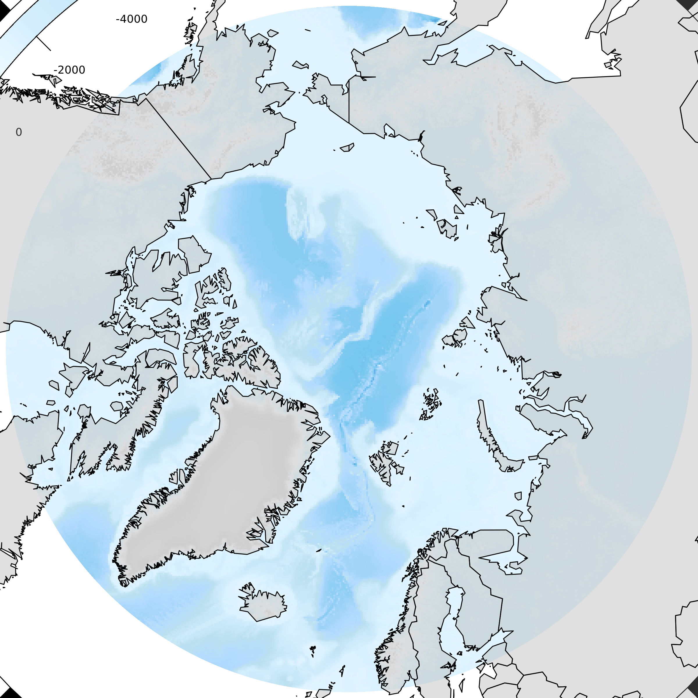

[](https://travis-ci.org/mdsumner/NOmap)
[](https://ci.appveyor.com/project/mdsumner/NOmap)
[](https://codecov.io/github/mdsumner/NOmap?branch=master)
[](https://cran.r-project.org/package=NOmap)

<!-- README.md is generated from README.Rmd. Please edit that file -->

# NOmap

The goal of NOmap is to make publication quality round Northern Ocean
maps in polar projections with little effort. This package is COMPLETELY
WIP AND WILL MAKE YOUR LIFE VERY BAD, DO NOT USE.

``` r
## see, you'll regret this
library(NOmap)
#> Loading required package: raster
#> Loading required package: sp
#> Warning: S3 method 'print.SOmap' was declared in NAMESPACE but not found
nmap <- NOmap(land = F)
#> Loading required namespace: rgeos
data("wrld_simpl", package = "maptools")
wrld_simpl <- subset(wrld_simpl, !NAME %in% "Antarctica")
plot(nmap)
NOmap::SOplot(wrld_simpl, col = grey(0.6, alpha = 0.3))
```



Please note that the NOmap project is released with a [Contributor Code
of Conduct](CODE_OF_CONDUCT.md). By contributing to this project, you
agree to abide by its terms.
