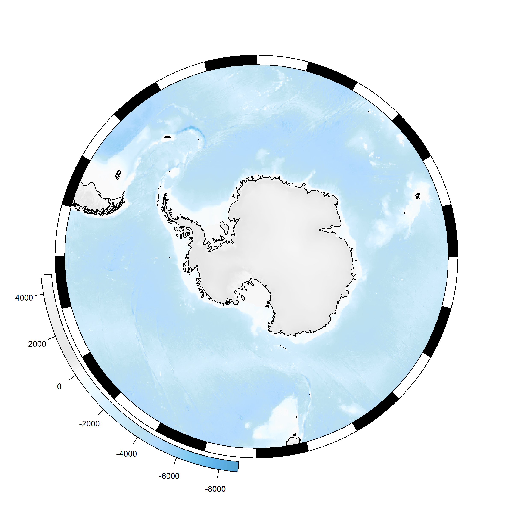
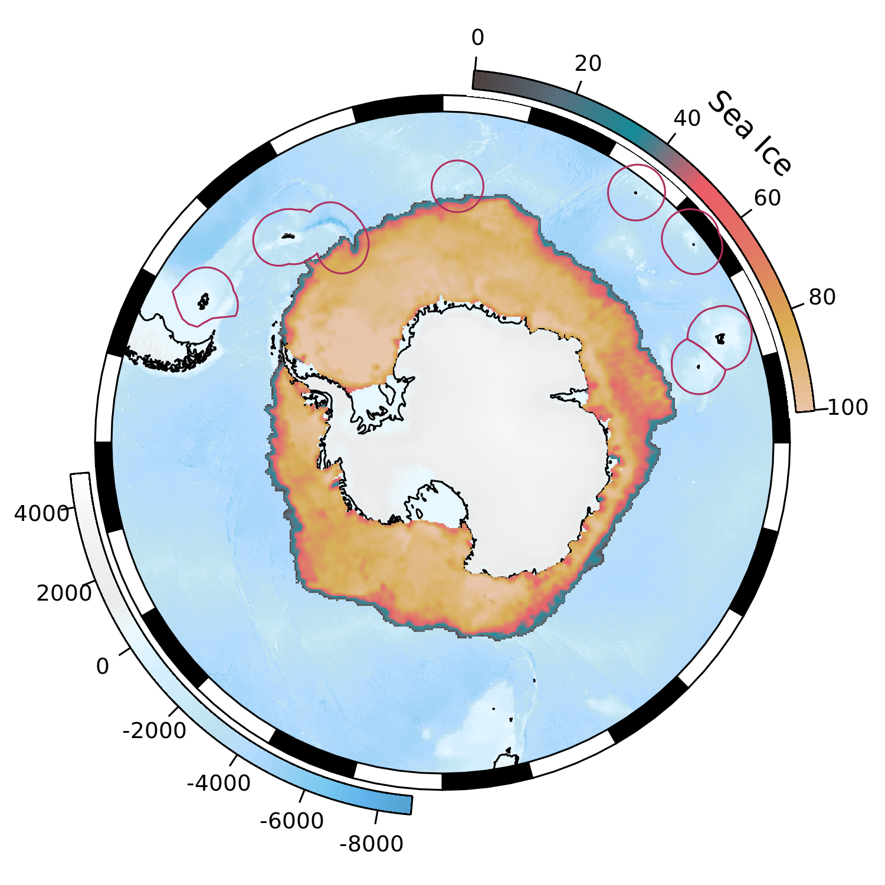
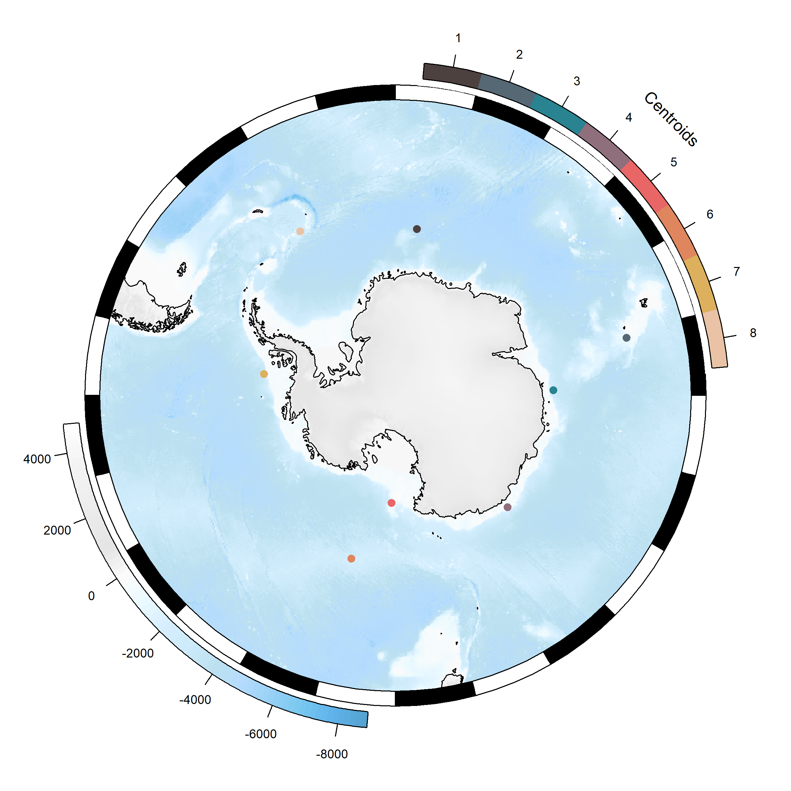
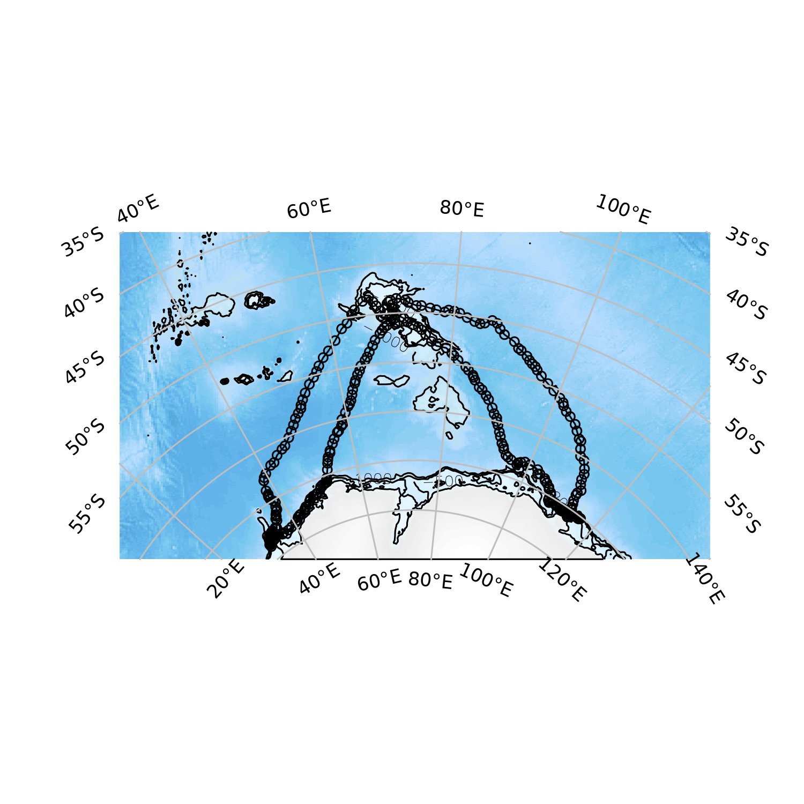
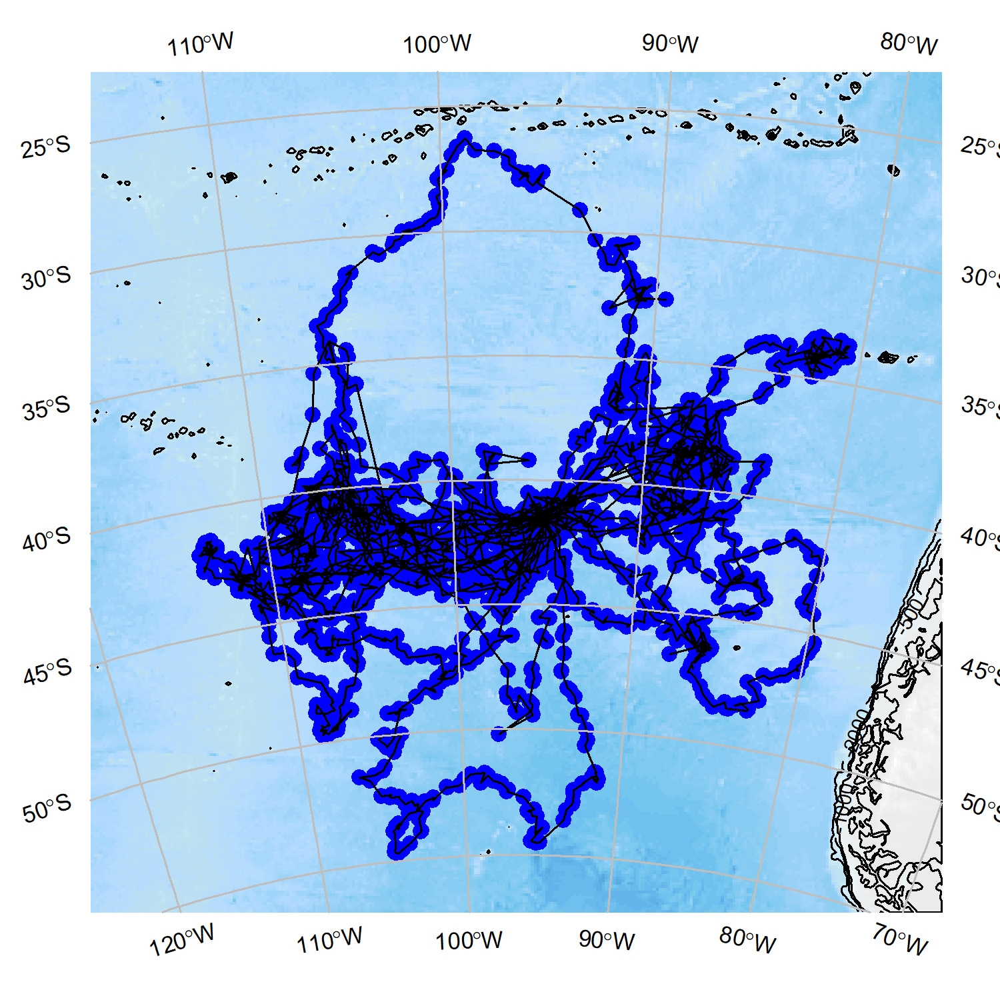
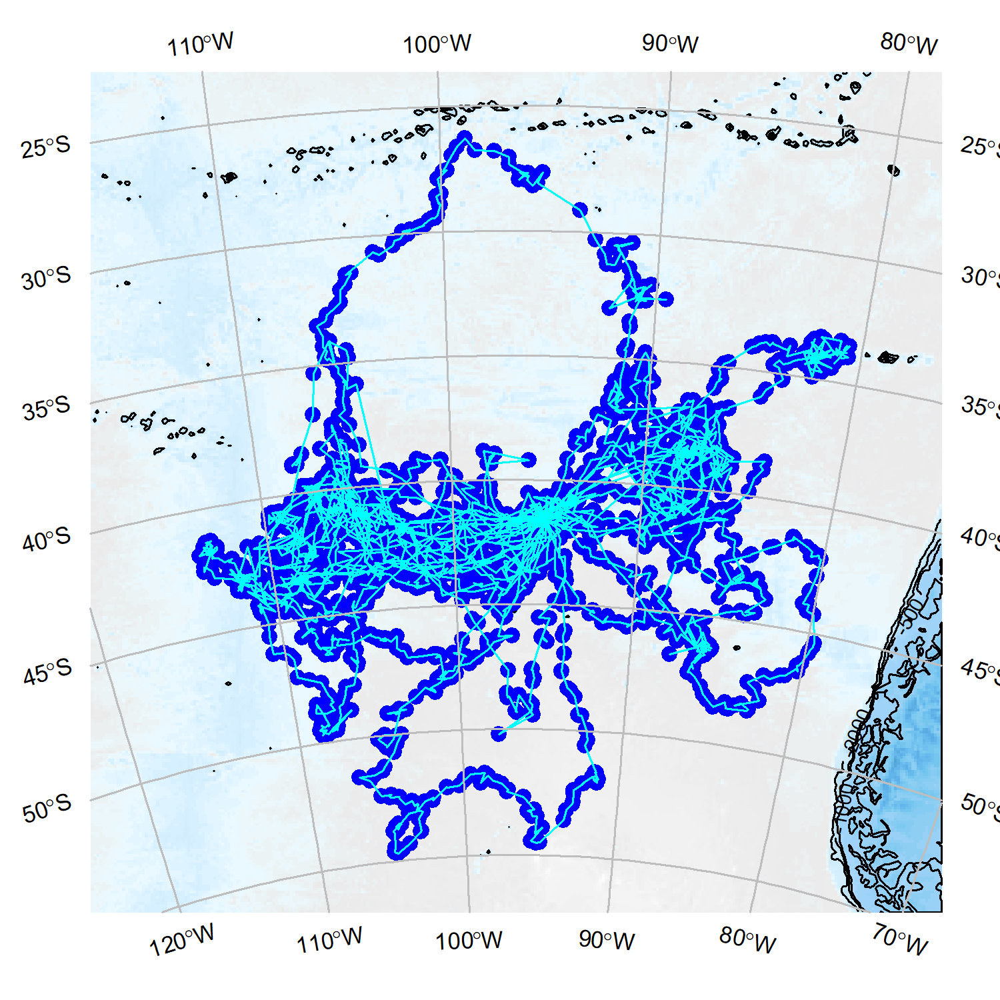
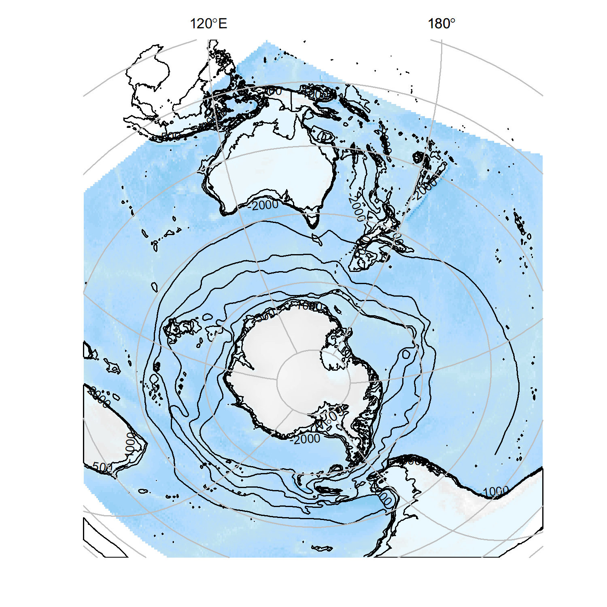
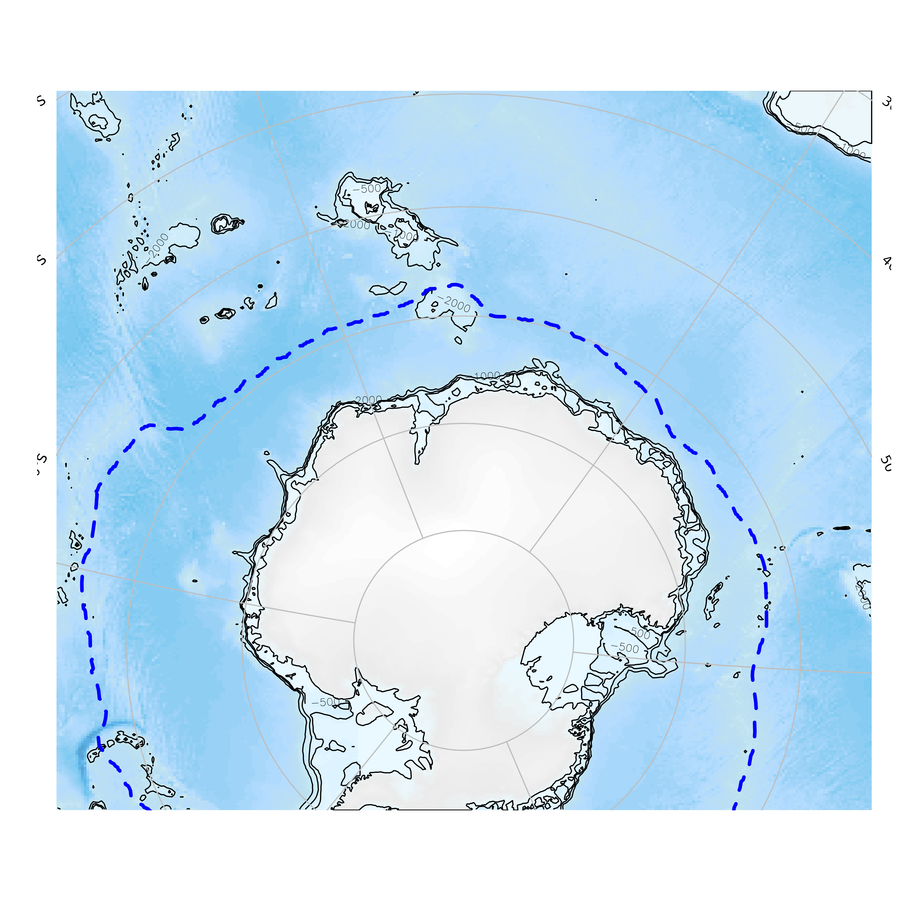
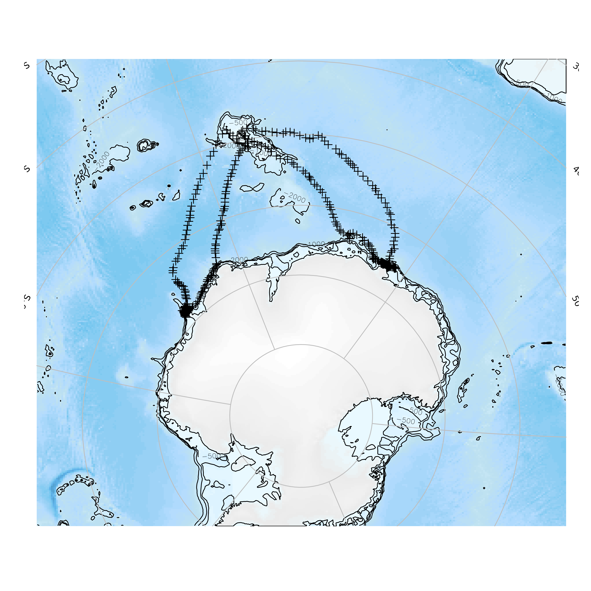
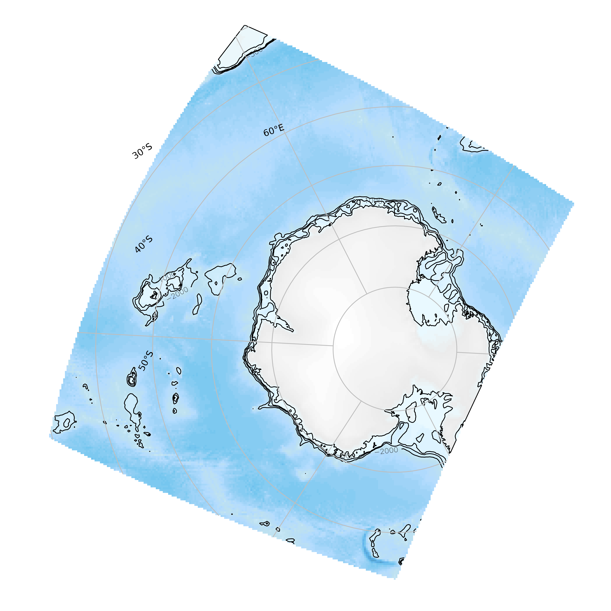

[](https://travis-ci.org/AustralianAntarcticDivision/SOmap)
[](https://ci.appveyor.com/project/mdsumner/SOmap)
[](https://codecov.io/github/AustralianAntarcticDivision/SOmap?branch=master)
[](https://cran.r-project.org/package=SOmap)

<!-- README.md is generated from README.Rmd. Please edit that file -->

# SOmap 

The goal of SOmap is to make publication quality round Southern Ocean
maps in polar projections with little effort. This package is still very
much a work in progress contact me with any questions or suggestions.

## Installation

The development version from
[GitHub](https://github.com/AustralianAntarcticDivision/SOmap) with:

``` r
## install.packages("remotes") ## if needed
remotes::install_github("AustralianAntarcticDivision/SOmap")
```

## Example

To make a simple map you can use the following function; use `? SOmap`
to see all the options for modifying layers.

``` r
library(SOmap)
SOmap()
```



There is also `SOmanagement()` which provides management layers for the
Southern Ocean and `SOleg()` which gives custom rounded legends for
added map layers.

``` r
## custom colours
spiritedMedium <- colorRampPalette(c("#4D4140", "#596F7E", "#168B98", "#ED5B67", "#E27766", "#DAAD50", "#EAC3A6"))
spirited <- spiritedMedium(80)

SOmap(Trim = -40)
## add an example sea ice raster, which is bundled with SOmap
plot(ice, col = spirited, add = TRUE, legend = FALSE, alpha = 0.95)
SOleg(ice, position = "topright", col = spirited, ticks = 6,
      tlabs = c("0", "20", "40", "60", "80", "100"),
      Trim = -40, label = "Sea Ice", type = "continuous")

## add the exclusive economic zones management layer
SOmanagement(EEZ = TRUE)
```



Curved legends can be either continuous (as above) or discrete.

``` r
spirited8 <- spiritedMedium(8)

SOmap()
plot(centroids, col=spirited8, add=TRUE, pch=19)
SOleg(centroids,position = "topright", col = spirited8, ticks = 8,
      tlabs =1:8, label = "Centroids", type = "discrete")
```



An **automatic** plot function `SOauto_map()` will take any data in the
form of longitude and latitude vectors and create a guess at a map.

``` r
ellie <- SOmap_data$mirounga_leonina

## construct and plot the map
SOauto_map(ellie$lon, ellie$lat)
```



The `SOauto_map`, `SOmap`, and `SOmap2` functions return the data used
to make the map so that further customization can be made. Plotting or
printing the returned object will cause the map to be displayed in the
graphics device.

``` r
data("albatross", package = "adehabitatLT")
## convert the albatross data to a single matrix of lon, lat points
albatrack <- do.call(rbind, lapply(albatross, function(z) rgdal::project(rbind(as.matrix(z[, c("x", "y")]), NA), "+proj=utm +zone=42 +south +datum=WGS84", inv = TRUE)))

## construct the map and return it, but don't plot it
alb_map <- SOauto_map(albatrack[, 1], albatrack[, 2])
```

Modifying this map object is currently a rather experimental process
(proceed at your own risk\!) but, for example, if we wished to change
the points to be blue rather than red:

``` r
alb_map$pcol <- "blue"
## plot it
alb_map
```



We could also decide we want a reversed bathymetry color and cyan lines
between the dots.

``` r
# change the line color 
alb_map$lcol <- "cyan"
# reverse the bathymetry
alb_map$bathy_palette<-rev(alb_map$bathy_palette)

## plot it
alb_map
```



Objects from `sf` or `sp` may also be used. (If a “raster” is given it
is used only for its extent.)

``` r
## use the bundled fronts data as an example
mydata <- SOmap_data$fronts_orsi
SOauto_map(mydata, family = "laea", centre_lon = 147, input_points = FALSE, lcol = 2)
```



## Easy projections

`SOmap` goes with the philosophy “we actually rather like ourselves, and
care about our experience” and so there are some easy ways to work with
projections, and <quote>just map it\!</quote>.

``` r
set.seed(25)
amap <- SOauto_map(input_points = FALSE, input_lines = FALSE)
amap
```


To add data to this plot we can just do so.

``` r
amap
SOplot(SOmap_data$seaice_oct, lwd = 3, col = "blue", lty = 2)
```



`SOplot()` will add data by default, and can take spatial objects or
even raw longitude and latitude values (we like you). When a plot is set
up the *coordinate reference system* used is recorded so that we can use
it again.

``` r
print(amap)
SOplot(SOmap_data$mirounga_leonina$lon, SOmap_data$mirounga_leonina$lat)
#> No projection provided, assuming longlat
```



The projection *currently in use* is always available by running
`SOcrs()`.

``` r
SOcrs()
#> [1] "+proj=stere +lon_0=82.346436 +lat_0=-72.542740 +lat_ts=-71 +datum=WGS84 +ellps=WGS84 +towgs84=0,0,0"
```

Many objects can be reprojected with `SOproj()`, including the map
objects themselves.

``` r
prj <- "+proj=laea +lat_0=-90 +lon_0=147 +datum=WGS84"
## reproject a raster
SOproj(ice, target = prj)
#> class       : RasterLayer 
#> dimensions  : 342, 326, 111492  (nrow, ncol, ncell)
#> resolution  : 32837.52, 31606.02  (x, y)
#> extent      : -5430639, 5274392, -5534313, 5274946  (xmin, xmax, ymin, ymax)
#> coord. ref. : +proj=laea +lat_0=-90 +lon_0=147 +datum=WGS84 +ellps=WGS84 +towgs84=0,0,0 
#> data source : in memory
#> names       : nt_20181015_f18_nrt_s.bin 
#> values      : 1.015509, 100  (min, max)

## reproject a SOmap
reproj(amap, prj)
```



Note that we must assume raw input is “longitude/latitude”, and the
function will issue a warning.

Please note that the SOmap project is released with a [Contributor Code
of Conduct](CODE_OF_CONDUCT.md). By contributing to this project, you
agree to abide by its terms.
